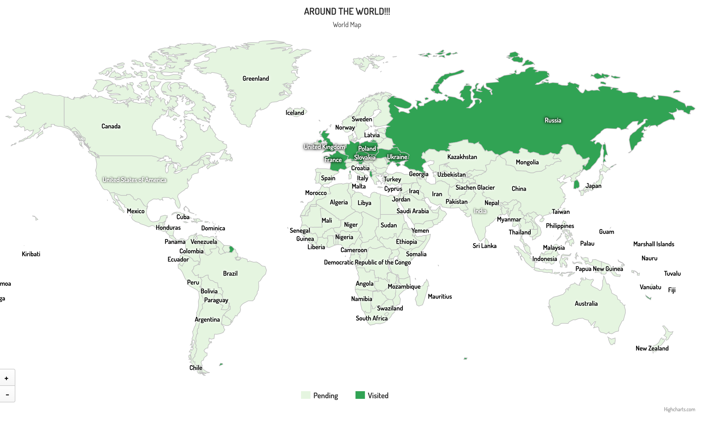
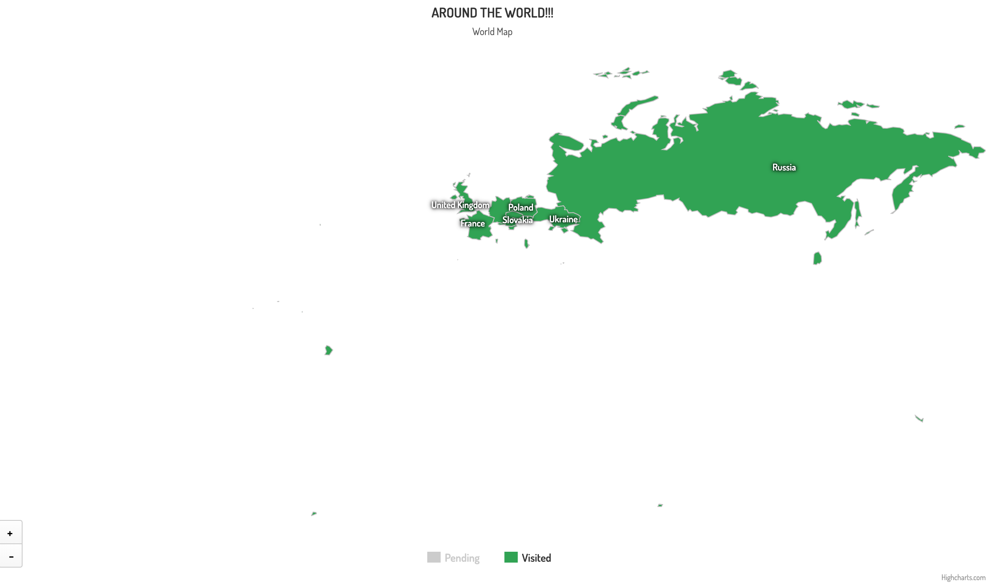
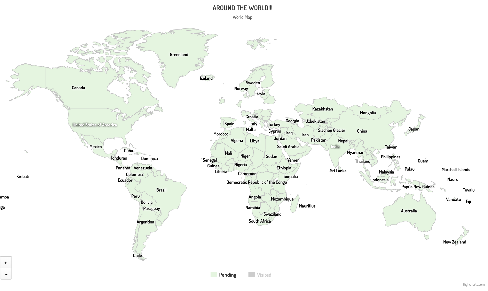

## Around The World

This map represents all countries that I was visiting over a few years. This is moustly buisness and provate trips. As you can easily see, these are mianly European and Asian countries. 

  

This is an example of visited countries. Countries that have been visited are marked in dark green on the map. 

  

Countries that I have not yet visited are marked in light green. 

  

